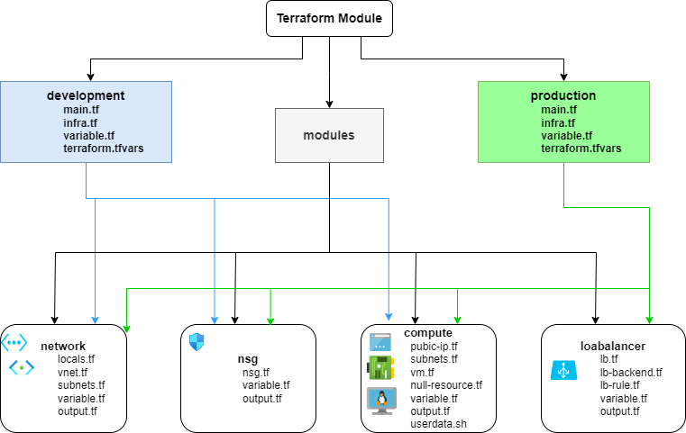

# Production-Level Terraform Deployment with Modular Structure

This Terraform project is built using a modular approach for creating infrastructure in Azure. The project is designed for production-ready deployment and supports multiple environments, such as development and production.

## Table of Contents

- [Prerequisites](#prerequisites)
- [Steps](#steps)
- [Project Structure](#project-structure)
- [Module Descriptions](#module-descriptions)
- [Environment-Specific Configurations](#Environment-specific-configurations)
- [Acknowledgement](#acknowledgement)
- [License](#license)

## Prerequisites

[Terraform](https://developer.hashicorp.com/terraform/install) installed

[Azure account](https://azure.microsoft.com/en-in/get-started/azure-portal) credentials with appropriate permissions

## Steps

1. **Clone the Repository** :

   ```bash
   git clone https://github.com/MathanKumar23/Terraform-Module.git

   cd Terraform-Module

   ```

2. **Initialize Terraform** :

   `terraform init`

3. **Plan the Infrastructure**

   `terraform plan`

4. **Apply the Configuration**

   `terraform apply`

Note: You'll be prompted to confirm before resources are created.

## Project Structure

The project is organized to maintain modularity, ease of management, and reusability across different environments.



> This structure illustrates the interdependency between each module and the main environment configurations, giving a clear overview of how different resources are created and interact.

## Module Descriptions

1. **Network Module**

Handles the virtual network (VNet) and subnet resources.

- locals.tf: Defines reusable tags or static values.

- vnet.tf: Creates a VNet with a specified resource group.

- subnets.tf: Manages public and private subnets using for_each and map(object).

- variable.tf: Parameterizes VNet and subnet configurations.

- output.tf: Outputs subnet IDs, VNet ID, and location for use in other modules.

2. **NSG Module**

Manages Network Security Groups (NSGs) with dynamic rule creation.

- nsg.tf: Defines NSGs with dynamic rule creation using for_each and subnet associations.

- variable.tf: Parameterizes NSG rules.

- output.tf: Outputs NSG IDs and configurations for use in other modules.

3. **Compute Module**

Creates virtual machines and necessary resources like NICs and public IPs.

- public-ip.tf: Creates public IP resources for VMs.

- nic.tf: Creates NICs based on environment values, supporting both public and private IP configurations.

- vm.tf: Defines private and public VMs.

- null-resource.tf: Uses provisioners to run scripts on VMs, allowing taint to recreate resources.

- userdata.sh: Shell script for VM provisioning.

- variable.tf: Parameterizes VM configurations.

- output.tf: Outputs private IPs for LB backend pool assignment.

4. **Load Balancer Module**

Creates a load balancer with backend and frontend configurations.

- lb.tf: Defines the public load balancer and its frontend IP.

- lb-backend.tf: Creates backend address pools.

- lb-rule.tf: Defines load balancing rules for routing traffic.

- variable.tf: Parameterizes LB configurations.

## Environment-Specific Configurations

**Each environment (development, production) includes:**

- main.tf: Specifies providers and remote backend configurations.

- infra.tf: Calls the necessary modules (network, NSG, compute, load balancer).

- variable.tf: Parameterizes environment-specific values.

- terraform.tfvars: Defines values for infrastructure creation.

## Acknowledgement

Documention([Azure](https://learn.microsoft.com/en-us/azure/developer/terraform/) [Terraform](https://registry.terraform.io/providers/hashicorp/azurerm/latest/docs), Stack overflow), Youtube videos and AI tools

## License

This project is licensed under the MIT License.
